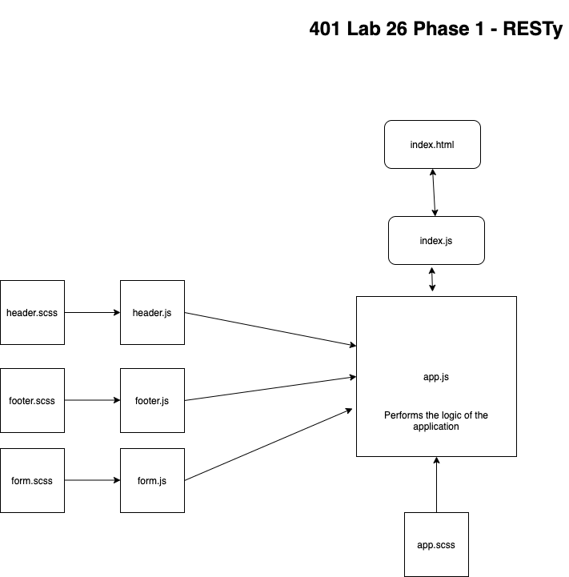
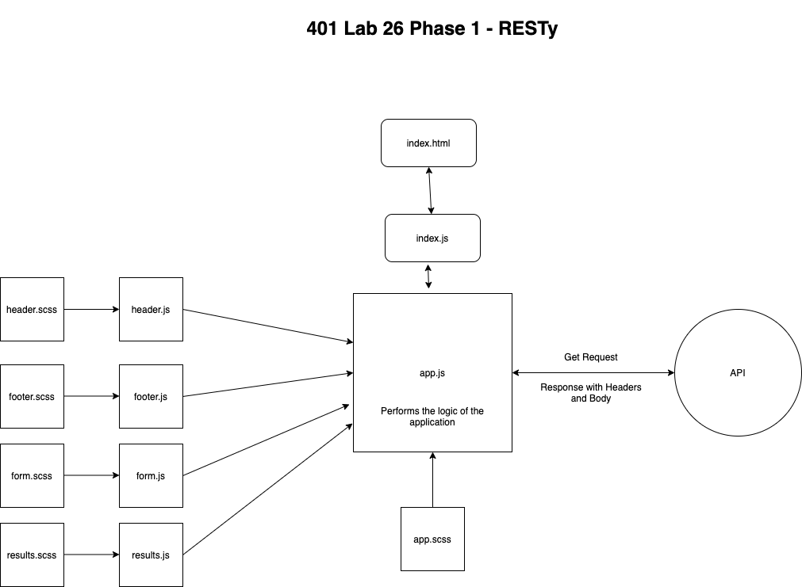

# LAB - Class 26

## Project: RESTy

### Author: Simon Panek

#### Contributors: Mariko, Nathan, Ricardo, Stacy, Michael Eclavea

### Links and Resources

- [GitHub Actions](https://github.com/simon-panek/RESTy/actions/new)

#### How to initialize/run your application (where applicable)

- `npm start` to start the app on `localhost:3000`

#### How to use your library (where applicable)

#### Routes

- GET: `https://ib9zg33bta.execute-api.us-west-2.amazonaws.com/modules/docs`
  - Will return all contents of the Mod-S database

#### Tests

- `npm test` runs the test suite

#### UML

