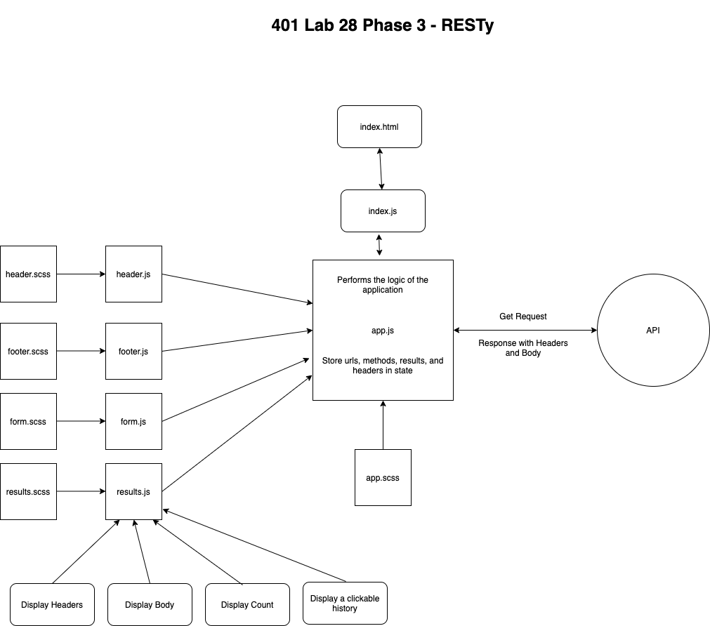

# LAB - Class 26

## Project: RESTy

### Author: Simon Panek

#### Contributors: Mariko, Nathan, Ricardo, Stacy, Michael Eclavea

### Links and Resources

- [Deployed Site](https://simon-panek.github.io/RESTy/)
- [GitHub Actions](https://github.com/simon-panek/RESTy/actions/new)

#### How to initialize/run your application (where applicable)

- `npm start` to start the app on `localhost:3000`

#### Tests

- `npm test` runs the test suite

#### UML




#### Testing Routes from [Fake API](http://fakeapi.jsonparseronline.com/)

##### GET

```js
fetch("http://fakeapi.jsonparseronline.com/posts/1")
    .then(response => response.json())
    .then(json => console.log(json))
```

##### POST

```js
fetch("http://fakeapi.jsonparseronline.com/posts", {
        "method": "POST",
        "body": {
            "title": "Libero et ut sit vitae et porta arcu lorem donec sed vehicula mattis praesent sed ultricies.",
            "content": "Et libero amet nec arcu lacinia sit diam ut sit ipsum sit donec congue sit. S",
            "userId": 1,
            "categoryId": 4,
            "imageUrl": "https://i.picsum.photos/id/866/700/400.jpg"
        },
        "headers": {
            "Content-type": "application/json; charset=UTF-8"
        }
    })
    .then(response => response.json())
    .then(json => console.log(json))
```

##### PUT

```js
fetch("http://fakeapi.jsonparseronline.com/posts/1", {
        "method": "PUT",
        "body": {
            "title": "Libero et ut sit vitae et porta arcu lorem donec sed vehicula mattis praesent sed ultricies."
        },
        "headers": {
            "Content-type": "application/json; charset=UTF-8"
        }
    })
    .then(response => response.json())
    .then(json => console.log(json))
```

##### DELETE

```js
fetch("http://fakeapi.jsonparseronline.com/posts/1", {
        "method": "DELETE",
        "headers": {
            "Content-type": "application/json; charset=UTF-8"
        }
    })
    .then(response => response.json())
    .then(json => console.log(json))
```
